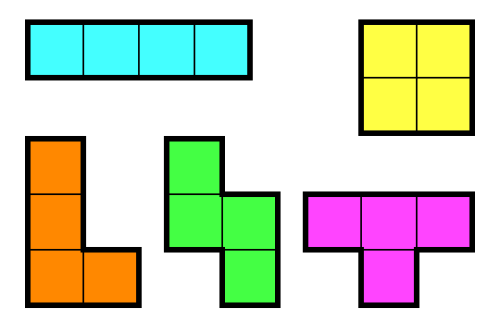

# 브루트포스

* 모든 경우의 수를 다 해보는 것
* 비밀번호가 4자리고 숫자로만 구성된 경우 0000~9999까지 다 입력하는 것을 의미
  * 경우의 수는 `10*10*10*10` = 10000가지
* 비밀번호가 12자리고 숫자로만 구성된 경우 000000000000~999999999999까지
  * 경우의 수는 1조가지 -> 사람이 직접 하기 어려움
  * 컴퓨터가 연산이 빠른 점을 이용해 사용하는 것
* 경우의 수를 다 해보는 데 걸리는 시간이 문제 시간 제한을 넘지 않아야 한다


### 브루트 포스로 문제를 풀기 위한 단계

1. 문제의 가능한 경우의 수를 계산
   * 직접 계산을 통해서 구함, 손계산
2. 가능한 모든 방법을 다 만들어 보기
   * 하나도 빠짐 없이 다 만들기
   * 그냥 다 하기, for문, 순열, 재귀호출, 비트마스크 사용
3. 각각의 방법을 이용해 답을 구함

* 브루트포스 문제의 시간 복잡도는 대부분 O(`경우의 수 * 방법을 시도하는데 걸리는 시간 복잡도`)


## 1. 그냥 다 하기

#### 문제

##### 1. 일곱난쟁이

왕비를 피해 일곱 난쟁이들과 함께 평화롭게 생활하고 있던 백설공주에게 위기가 찾아왔다. 일과를 마치고 돌아온 난쟁이가 일곱 명이 아닌 아홉 명이었던 것이다.

아홉 명의 난쟁이는 모두 자신이 "백설 공주와 일곱 난쟁이"의 주인공이라고 주장했다. 뛰어난 수학적 직관력을 가지고 있던 백설공주는, 다행스럽게도 일곱 난쟁이의 키의 합이 100이 됨을 기억해 냈다.

아홉 난쟁이의 키가 주어졌을 때, 백설공주를 도와 일곱 난쟁이를 찾는 프로그램을 작성하시오.

* 입력

  아홉 개의 줄에 걸쳐 난쟁이들의 키가 주어진다. 주어지는 키는 100을 넘지 않는 자연수이며, 아홉 난쟁이의 키는 모두 다르며, 가능한 정답이 여러 가지인 경우에는 아무거나 출력한다.

  20

  7

  23

  19

  10

  15

  25

  8

  13

* 출력

  일곱 난쟁이의 키를 오름차순으로 출력한다. 일곱 난쟁이를 찾을 수 없는 경우는 없다.

  7

  8

  10

  13

  19

  20

  23

* 방법

  * 난쟁이의 수  = N
  * 9명 중 7명 = 9명중 2명을 고른다와 같음
    * 9C2 = 36가지
    * `nC2의 경우 (N(N-1))/2 므로 시간 복잡도는 O(N^2)`
  * 나머지 난쟁이의 키의 합
    * `N-2 = O(N)`
  * 총 시간복잡도
    * `O(N^2) * O(N) = O(N^3)`
    * 9 ^ 3 = 729rkwl

````java
import java.util.*;

class main6 {
    public static void main(String[] args) {

        Scanner sc = new Scanner(System.in);
        int arr[] = new int[9];
        int totalSum = 0;
        int one = 0, two = 0;
        ArrayList <Integer> list = new ArrayList<>();
        for (int i = 0; i < 9; i++) {
            arr[i] = sc.nextInt();
            totalSum += arr[i];
        }
        

        for (int i = 0; i < 8; i++) {
            for (int j = i+1; j < 9; j++) {
                if (totalSum - (arr[i] + arr[j]) == 100) {
                   one = arr[i];
                   two = arr[j];
                    
                }
            }
            

        }

          for(int i= 0; i<arr.length; i++){
            if(!(arr[i]==one || arr[i]==two)) {
                list.add(arr[i]);
            }
            
        }
        Collections.sort(list);
        
        for (int i : list) {
            System.out.println(i);
        }

        sc.close();

    }
}
````

````java
import java.util.*;
public class Main {
    public static void main(String args[]) {
        Scanner sc = new Scanner(System.in);
        int n = 9;
        int[] a = new int[n];
        int sum = 0;
        for (int i=0; i<n; i++) {
            a[i] = sc.nextInt();
            sum += a[i];
        }
        Arrays.sort(a);
        for (int i=0; i<n; i++) {
            for (int j=i+1; j<n; j++) {
                //i : 0~8
                //j : i+1~8
                if (sum - a[i] - a[j] == 100) {
                    //다 더한값 - i - j 가 100이면
                    for (int k=0; k<n; k++) {
                        if (i == k || j == k) continue;
                        System.out.println(a[k]);
                        //i/j값 빼고 다 출력
                    }
                    System.exit(0);
                }
            }
        }
    }
}
````


##### 2. 날짜 계산

준규가 사는 나라는 우리가 사용하는 연도와 다른 방식을 이용한다. 준규가 사는 나라에서는 수 3개를 이용해서 연도를 나타낸다. 각각의 수는 지구, 태양, 그리고 달을 나타낸다.

지구를 나타내는 수를 E, 태양을 나타내는 수를 S, 달을 나타내는 수를 M이라고 했을 때, 이 세 수는 서로 다른 범위를 가진다. (1 ≤ E ≤ 15, 1 ≤ S ≤ 28, 1 ≤ M ≤ 19)

우리가 알고있는 1년은 준규가 살고있는 나라에서는 1 1 1로 나타낼 수 있다. 1년이 지날 때마다, 세 수는 모두 1씩 증가한다. 만약, 어떤 수가 범위를 넘어가는 경우에는 1이 된다.

예를 들어, 15년은 15 15 15로 나타낼 수 있다. 하지만, 1년이 지나서 16년이 되면 16 16 16이 아니라 1 16 16이 된다. 이유는 1 ≤ E ≤ 15 라서 범위를 넘어가기 때문이다.

E, S, M이 주어졌고, 1년이 준규가 사는 나라에서 1 1 1일때, 준규가 사는 나라에서 E S M이 우리가 알고 있는 연도로 몇 년인지 구하는 프로그램을 작성하시오.

* 입력

  첫째 줄에 세 수 E, S, M이 주어진다. 문제에 나와있는 범위를 지키는 입력만 주어진다.

  1. 1 16 16

  2. 1 1 1
  3. 1 2 3
  4. 15 28 19

* 출력

  첫째 줄에 E S M으로 표시되는 가장 빠른 연도를 출력한다. 1 1 1은 항상 1이기 때문에, 정답이 음수가 나오는 경우는 없다

  1. 16
  2. 1
  3. 5266
  4. 7980

* 풀이

  * 가능한 경우의 수를 구함
  * `15*28*19` = 7980가지
  * 

##### 3. 테트로미노

https://www.acmicpc.net/problem/14500

폴리오미노란 크기가 1×1인 정사각형을 여러 개 이어서 붙인 도형이며, 다음과 같은 조건을 만족해야 한다.

- 정사각형은 서로 겹치면 안 된다.
- 도형은 모두 연결되어 있어야 한다.
- 정사각형의 변끼리 연결되어 있어야 한다. 즉, 꼭짓점과 꼭짓점만 맞닿아 있으면 안 된다.

정사각형 4개를 이어 붙인 폴리오미노는 테트로미노라고 하며, 다음과 같은 5가지가 있다.

[](https://commons.wikimedia.org/wiki/File:All_5_free_tetrominoes.svg)

아름이는 크기가 N×M인 종이 위에 테트로미노 하나를 놓으려고 한다. 종이는 1×1 크기의 칸으로 나누어져 있으며, 각각의 칸에는 정수가 하나 쓰여 있다.

테트로미노 하나를 적절히 놓아서 테트로미노가 놓인 칸에 쓰여 있는 수들의 합을 최대로 하는 프로그램을 작성하시오.

테트로미노는 반드시 한 정사각형이 정확히 하나의 칸을 포함하도록 놓아야 하며, 회전이나 대칭을 시켜도 된다

* 입력

  첫째 줄에 종이의 세로 크기 N과 가로 크기 M이 주어진다. (4 ≤ N, M ≤ 500)

  둘째 줄부터 N개의 줄에 종이에 쓰여 있는 수가 주어진다. i번째 줄의 j번째 수는 위에서부터 i번째 칸, 왼쪽에서부터 j번째 칸에 쓰여 있는 수이다. 입력으로 주어지는 수는 1,000을 넘지 않는 자연수이다.

  1. 예제

     5 5

     1 2 3 4 5

     5 4 3 2 1

     2 3 4 5 6

     6 5 4 3 2 

     1 2 1 2 1

  2. 예제

     4 5

     1 2 3 4 5

     1 2 3 4 5

     1 2 3 4 5

     1 2 3 4 5

  3. 예제

     4 10

     1 2 1 2 1 2 1 2 1 2

     2 1 2 1 2 1 2 1 2 1 

     1 2 1 2 1 2 1 2 1 2 

     2 1 2 1 2 1 2 1 2 1

* 출력

  첫째 줄에 테트로미노가 놓인 칸에 쓰인 수들의 합의 최댓값을 출력한다.

  1. 19
  2. 20
  3. 7

* 풀이

  * 폴리오미노는 크기가 1*1인 정사각형을 여러 개 이어 붙여서 만든 도형
  * 정사각형 4개를 이어 붙인 폴리오미노는 테트로미노라고도 하며 총 5가지가 있음
  * N*M 크기의 종이 위에 테트로미노를 하나 놓아 놓인 칸에 쓰여 있는 수의 합을 최대로 하는 문제
  * 4<=N, M <=500
  * 1)
    * 눕히거나 세우거나 : 2가지
  * 2) 
    * 돌려도 똑같음 : 1가지

  * 3)
    * 8가지
  * 4) 
    * 4가지
  * 5)
    * 4가지
  * 총 19가지