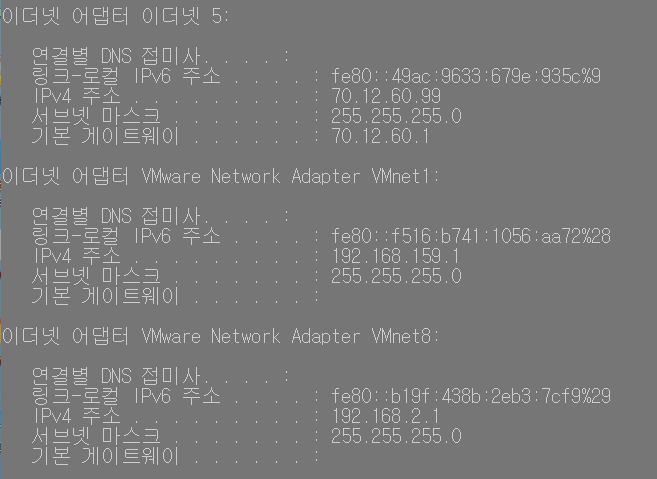
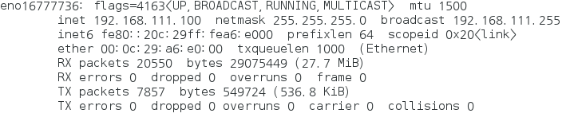
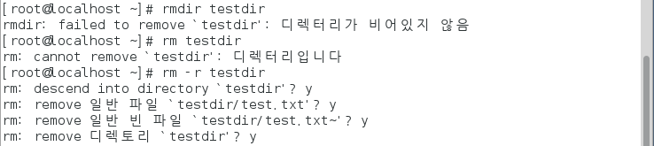
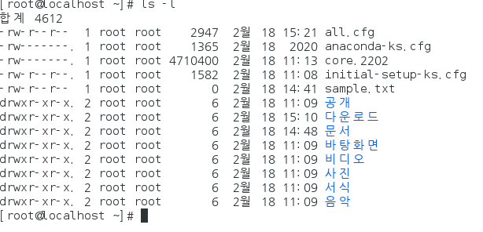

# linux1

### 데이터베이스 빅데이터

* 관계형 데이터 베이스 : 모든 데이터를 테이블 형태로 구성, 컬럼명, 길이, 타입, 제약조건 등 필요
  * ex) 오라클 
* 빅데이터 : 길이, 타입(문자, 숫자, 날짜), 제약조건 타입지정하지 않음
  * 데이터가 쌓여가는 속도가 빠름, 양도 많음, 비정형 데이터(타입이 정해지지 않음)
* 빅데이터 저장/처리 프로그램 : 하둡
  * 하둡 설치 : 리눅스환경!!
  * windows에 가상컴퓨터 역할을 하는 프로그램(vm) 설치 + 리눅스 + 하둡

## 환경 설정

### 가상컴퓨터

* 실제 컴퓨터 os : windows (hos os)

* 가상 컴퓨터 os : linux(guest os)
* 1대의 PC에 2개의 OS를 사용하는 환경으로
  * 하둡할 때 1대의 PC에 4개의 OS를 사용하는 환경으로 변경

### vm 설치

* vm : virtual box, vmware 등의 툴이 있음

  * [vmware 설치](https://www.vmware.com/kr.html) 
    * window용 workstation 15.5 player (최신형)

* 후에 환경변수 설정 편하게 하기 위해

  * `c:\vmware` 입력

* create a new virtual machine

  * c\에 hadoop 폴더 생성

  * i willl install the operating systam later
  * guest operating system
    * linux - Centos 7 64-bit
  * 가상머신 이름 vm1으로 설정
  * Location :  c:\hadoop
  * 나머진 그대로 

* Edit virtual machine settings

  * memory : 2048mb (2GB)
  * processors
  * hard Disk - remove
    * add -  harddisk - create a new virtual disk - maximun disk size : 80 
    * 서버용은 scsi (스카시)으로 쓴다
  * network Adapter : NAT
    * advanced - MAC Adress (차후에 설정)

* ctrl+ alt : 마우스포인터가 안나올때

  * 마우스 획득권을 host가 아닌 vm이 가져오는 키

#### 종료의 종류

* suspend : 이전 작업 기억
* power off : 이전작업 무시

#### 네트워크 확인 VMnet8 아이피 변경

* vm 여러개 설치할때 vm끼리 통신해야되서 가상의 ip를 만들어줌
* vmnet 8로 통신해아 하는 애들은192.168.111.xxxx 로 통일시키기

* window - command - ipconfig - 에서

* vmnet 8 : 192.168.2.1 인것 확인 <- 변경

* 같은 네트워크 통신 그룹에 있다는 것을 알려주기 위해

* `C:\vmware`에 vmnetcfg.exe 넣어두고 실행
  * chang settings - vMnet8 - subnet IP : 192.168.111.0

​	

### linux 설치

* [centos 7.0.1406버전](http://archive.kernel.org/centos-vault/7.0.1406/isos/x86_64) 의 iso 파일 설치

* vm1 -Edit virtual machine- CD/DVD (IDE)-  use ISO image file
  *  iso 파일 경로 입력
* vm1 플레이 - 리눅스 설치 - 언어 : 한국어
* 키보드 영어(미국) 추가 / 영어를 default로 상단에 올라가게
* sw선택 : 개발 및 창조를 위한 워크스테이션
* 네트워크 및 호스트 이름 : Ethernet - 켬
* 설치 목적지 :  
  * 로컬 표준디스크 : 선택 (체크표시떠야함) 
  * 파티션 설정  : 파티션을 설정합니다
  * 새로운 CentOS 7설치 : 표준 파티션
  * '+'버튼 새 마운트 지점 추가 - swap - 용량 2g : 마운트 지점 추가
  * `+` 마운트 지점 `/` 원하는 용량 비워두기
* 설치 
*  root 비밀번호 : password
* 사용자생성
  * 성명 : centos
  * 암호  :centos
* kdump활성화 안함
* 로그인 : 사용자 목록에 없음 / root /password 입력후 로그인
* 온라인 계정 - 한국어 두개면 하나 지우기

## 리눅스 환경

* xwindow : 바탕화면
* 터미널 : 보통의 작업공간
* player - virtual machine settings
  * setting시에는 vm을 종료하고 세팅작업하기
* root : 알림설정 끔
  * 설정 : 디스플레이 1024 * 768
* 설정 - 전원 - 절전 - 빈화면 - 안함
* 프로그램 - 시스템도구 - 소프트웨어
  * 소프트웨어 항목에서 : 최신패키지만 , 전용패키지만 끄기
  * 소프트웨어 공급원 : 업데이트확인 : 하지않기

## 리눅스

cd /etc/yum.repos.d

ls

gedit CentOS-Base.repo

gedit : 메모장 같은...

released updates 주석처리 `#`

CentOS-Sources.repo - released updates 주석처리

su - 

cd /etc/yum.repos.d/

mv CentOS-Base.repo CentOS-Base.repo.bak

wget http://download.handbit.co.kr/centos/7/CenOS-Base,repo

chmod 644 *

fm -f **

도스 키 : 이전 명령어 사용

---

* windows : 폴더 (구분자 : `\` ex) \test\a.java)
  * = linux : 디렉토리 (구분자 : / ex) /test/a.java )

wget : 다운로드

* yum :  다운로드 + 설치 (/etc/yum.repos.d/*.repo*)
  * 루트 밑 ete - yum.repos 디렉토리에서 repo 파일들

### 고정아이피 설정

* 터미널 : #ifconfig
  * end16777736 : 192.168.111.128
* cd /etc/sysconfig/net-scripts/ifcfg-eno16777736

#### 파이어 폭스 업그레이드

* vm1 : NAT : VMNET8: VM컴퓨터 + 호스트 컴퓨터들 
* 192..168.111.0~255

cd : change directory

pwd : 현재 작업하고 있는 디렉토리 목록

* 

#### IP 고정시키기

* ifcfg-eno16777736 설정파일 (118P)

* hwaddr  : ~~~~

* BOOTROTO : dhcp자동할당 
  * none으로 수정
* IPADDR=192.168.111.100
* NETMASK:255.255.255.0
  * 네트워크로 묶을때
* GATEWAY=192.168.111.2
  * 외부컴퓨터를 거쳐서 나갈때
* DNS1:192.168.111.2
  * 도메인
* 저장 후 터미널에서`systemctl restart network` 입력
  * 네트워크 재시작
* ifconfig 에서 inet 바뀐것 확인

#### SELinux 기능 끄기

* gedit /etc/sysconfig/selinux
  * 혹은 cd ect/sysconfig 후 geit /selinux 로 해도 됨
* SELINUX=disabled

## 리눅스 명령어들

* `#cat /etc/redhat-release` 
  * 리눅스 버전 확인
* `/` 루트
* `/root-->root`
  * 계정 관련 저장 디렉토리
* `/home/사용자/~`
  * `해당 계정 관련 디렉토리`
* `/etc/xxx`
  * 설정파일을 저장하는 디렉토리
* `/usr/...` : 모든 계정을 사용하는 디렉토리
* `shoutdown -P now`
  * 지금 시스템 종료
  * shoudown -P +10
    * 10분 뒤 시스템 종료
* `halt -p`
  * 시스템 종료
* `init 0`
  * 시스템 명령중 0을 실행하라
    * 시스템 명령은 0~6까지 있다
  * 시스템 종료
* `poweroff`
  * 시스템 종료
* `shoutdown -r now`
  * 시스템 재시작
* `reboot`
  * 설정파일 변경사항 반영 후 시스템 재시작
* `init 6`
  * 6번 명령 시작
  * 시스템 재시작

#### 런 레벨

0 : poweroff : 종료

1 : rescue : 시스템 복구

3:Multi-User : 텍스트 모드의 다중 사용자 모드

자동 터미널

5:Graphical : 그래픽 모드의 다중 사용자 모드

centos는 기본으로 그래픽모드로 실행된다

6:Reboot

#### 도스키 / 자동완성

dos key : 화살표 위, 아래 - 이전 명령어 실행

history : 이전 명령어를 다 보여줌

history -c : 이전 명령어 모두 삭제

#### 파일 정보 확인 (183p)

* man ls 도움말

* ls 파일명

  * 파일 정보 확인

* ls -l

  * 현재 디렉토리의 상세한 목록

* ls -a

  * 숨김파일을 포함해서 보여줌
  * 숨김파일명은 .으로 시작함

* ls /etc/sysconfig 

  * etc/sysconfig 디렉터리의 목록

* ls --color

  * 파일 속성에 따라 색이 달라짐

  

* cat 파일명

  * 파일 내용 확인 (입력/수정 불가능)

* gedit 파일명

  * 파일내용 출력(입력가능)

* vi 파일명 (gedit 명령어 나오기 전. 복잡)

  * i : 입력내용
  * q : 저장내용

* cd : change directory
* cd ..
  * 상위
* cd/etc/sysconfig
  * 루트의 etc/sysconfig 로 이동
  * 
* cd etc/sysconfig
  * 현재 디렉토리의 etc/sysconfig로 이동
  * 

* toucn
  * 크기가 0인 파일생성 (아무것도 없는 파일 생성)

pwd : 현재 작업 디렉토리

* cp

  * copy 복사

* mv 

  * 파일 이동 
  * 이름 바꿔서 이동 가능

* rm  : 삭제

  * rm -f : 강제삭제
    * 루트에서 실행시 하드 다 삭제하게 되니 주의
  * rm -r : 하위항목까지 삭제

  

* mkdir

  * 디렉토리 생성

* cat 

  * 파일의 내용만 보기
  * cat 파일명 1 파일명2 > 파일명 3
    * 파일명 3의 내용을 없애고 파일명 1 파일명2를 협친 결과를 넣음
    * 파일3은 파일이 없어도 생성됨
  * cat 파일명 1 파일명2 >> 파일명3
    * 기존의 내용을 삭제하지 말고 파일명 1 파일명2 를 넣어라 

* head/ tail

  * head  10 all.cfg
    * 첫부분부터 10줄만 보여주기
  * tail -10 all.cfg
    * 마지막 줄붕터 10줄만 보여주기
  * more
    * 한 화면씩만보여줌
      * 엔터 누르면 페이지 넘어감

* clear

  * 화면 지움

---

### 파일 디렉토리 사용 권한 부여

* 사용권한 3가지 파일마다 다르게 적용이 가능하다
* ls -l

* `- rw- / r--/ r--`
  * 현재계졍(root계정)에 대해 - root와 같은 그룹의 사용자 - 다른 사용자 그룹
  * `-`파일
  * `rw-` r: read w : write  -:시행파일 아님 (맞으면x)
* `- rw-------`

-

### jdk, tomcat, oracle 리눅스 환경에서 설치

