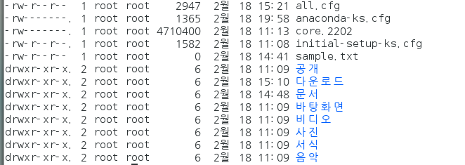
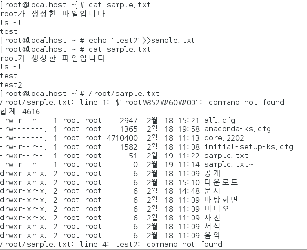
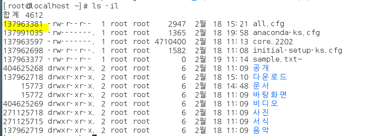

# linux 2


* `cd /home/centos` 
  * centos 디렉토리로 

* `ls` 
  * 파일목록 확인
* `cat`
  * 파일을 읽기만 함
* `more`
  * 파일을 읽는데 페이징처리가 됨
* `gedit`
  * 문서편집창을 띄움(문서편집가능)
* `til -5`
  * 맨 아래 5줄, 새로추가된 5줄 확인
* `head 5`
  * 맨 위의 5줄, 루트정보 확인할 때


#### 계정관련 명령어

* 명령어 실행시
  * `#` : 루트 계정
  * `$`: 일반사용자 계정

* `whoami`: 사용자 확인하는 명령어

* root

* centos(일반계정)

* `su -centos`
  * cnetos로 계정 이동
  * root에서 이동할 시, 계정의 비밀번호는 필요없다
    * root는 모든 계정의 위에 있기 때문
  * 

* `exit`
  *  다시 root 계정으로 되돌아가기
  * 


#### 사용자 정보 확인 명령어

* `gedit /etc/passwd`
  * 사용자리스트
  * 1000번부터 우리가 만든 계정
* `gedit /etc/shadow`
  * 계정들의 암호정보를 보여줌
  * 
    * ! : 암호가 설정되어 있지 않음
    * 암호가 있으면 암호화되어서 나타남
* `gedit /etc/shadow`
  * 사용자 그룹정보를 볼 수 있음
  * root는 0번그룹이다

> 리눅스는 사용자그룹에 속해져있는 사용자 형식으로 되어있음
>
> root그룹의 root사용자
>
> centos그룹의 centos사용자
>
> 사용자 그룹은 복수의 사용자에게 파일권한을 줄 때 유용함 

#### root 계정만 사용가능한 명령어

* 사용자 생성, 그룹변경은 root 계정만 가능하다
* `useradd testuser1`
  * testuser1 사용자 추가
  * 사용자그룹 : testuser1
    * 생성될때 기본적으로 사용자 이름과 동일
  * 암호설정x
  * 식별자값 : 1001
    * 1000번부터 순차적으로 입력된다
* `passwd testuser1`
  * 사용자의 비밀번호를 변경한다
  * 
* `usermod -g root testuser1`
  * 사용자 그룹수정
  * test1유저를 root그룹으로 수정
* `groupdel testuser1`
  * 그룹삭제
* `userdel testuser1`
  * testuser1 삭제
  * `userdel -r testuser1`
    * testuser1 디렉토리까지 삭제
  * 만약 디렉토리를 안지우면 같은 이름으로 생성시 이미 있는 id라고 뜬다


#### 사용자 관리 프로그램

* X 윈도 환경에서 사용자 관리가능
* `yum -y install system-config-users`
  * 사용자 관리 프로그램 설치
  * -y 다 yes니까 무조건설치
* `system-config-users`
  * 실행


#### 파일과 디렉터리의 소유와 허가권

* `ls -l`
  * 파일의 허가권 확인
  * `ls -la`
    * 숨김파일(.으로 시작하는 파일명)까지 보여준다



파일권한            소유자  디렉토리


##### 맨 앞 ==- 와 d== : 파일의 유형

* 아무 것도 없으면 파일
* d는 디렉토리

##### 두번째 ~ 끝 : 파일의 허가권


​       		나                        					내가 포함된 그룹					나랑 다른 그룹

* 각각 rwx를 지정함
  * r : 읽기 (4/0)
  * w :쓰기 (2/0)
  * x :실행(1/0)
* 7을 준다 : r은 4 w는 2 x는 1
  * 읽기가능, 쓰기 가능, 실행 가능
* 6을 준다 : r은 4로 w는 2로 x는 0으로
  * 읽기 가능, 쓰기 가능, 실행 불가능
* 4를 준다 : r은 4로, w는 0, x는 0
  * 읽기 가능, 쓰기 불가능, 실행 불가능

* `chmod 777` test

  * rwxrwxrwx
  * test의 소유자, 그룹, 그외사용자에게 rwx 권한을 모두준다

* `chmod000 test`

  * `---------`
  * 모든 권한 없음

* `chmod 644 test`

  * rw-r--r--
  * 나만 편집가능 다른 이용자는 읽기만 가능

  

* `chown centos test`

  * 사용자 변경
  * test의 소유주를 centos로 바꾸겠다
  * root만 사용가능

  

* `chgrp user test`

  * 사용자 그룹변경
  * test를 user로 바꾸겠다





#### 단축아이콘 만들기 

* 202p

* `ln 원본 링크 이름`
  * 하드
* `ln -s 원본 링크 이름`
  * 심볼릭

* `ls -il`
  * 파일의 아이노드와 허가권 확인
  * 

* `ln link.txt hardlink`
  * 원본파일이 누군지 알려주지않음
  * 원본 손실을 막는다
* `ln -s link.txt softlink`
  * 원본파일이 누군지 알려줌
  * softlink는 자료유형이 `l`이다


* 원본파일을 삭제 (`rm link.txt`)

  * hard : 원본파일을 없애도 읽기 가능
  * soft : 원본파일을 없애면 읽기 불가능

  > 바일 단축아이콘 hard (디렉토리적용x)
  >
  > 디렉토리 연결원하면 soft/symbolic링크

#### 설치파일

* 리눅스 rmp
  * 윈도우 exe
  * `rpm`
    * 파일 설치/삭제/설치정보 확인
    * `rpm.-Uvh *.rpm`
    * `rpm -e*` : 삭제
    * rpm `qa jdk*`
    * rpm qip.rmp
      * 미설치 프로그램 정보 조회
  * `yum`
* 

* 압축해제
  * zip, tar, tar.bz, tar.gz
  * `tar`
  * `unzip`


* u : 없으면 신규 / 있으면 업그레이드
* v : 설치 과정 출력
* h : 설치 진행정도를 ###으로 보여줌


#### 명령문

* `(명령문)|(명령문)`
  * 앞쪽의 명령어를 뒤쪽의 매개변수로 보낸다
* `>`
  * redirection 
  * 앞쪽에 있는 결과물을 뒤쪽에 넣음 (전의 글 삭제됨)
* `>>`
  * 앞쪽에 있는 결과물을 뒤쪽에 넣음 (추가)
* `$PATH`
  * 경로 미리 설정


#### 파일 위치 찾기

* `whereis`
* `which`
  * path경로에 등록된 경로의 파일명을 찾아줌
* `rpm -qa rmp파일명`
* `find`
  * 종류를 안가리고 모든 파일을 찾아줌
  * `find /root -name jdk*`
    * 루트디렉토리에서 jdk로 시작하는 파일명 찾아오기
  * `find /root -perm 777`
    * 권한이 777인 모든 파일 찾기
  * `find /-name jdk*`
    * jdk 파일 다 찾기
  * `find /root -user centos`
    * user에 있는 파일 찾기


#### RMP 파일(208p)

* ` rpm -Uvh mc-4.8.7-8.el7.x86_64.rpm`
  * 설치 `rpm -Uvh`

* `rpm -qa mc`
  * 찾기

* `rpm -e mc`
  * 삭제


* mysql은 libodbc를 먼저 깔아야 함 (의존성)
  * RPM은 의존성의 문제가 있음
  * 설치파일이 미리 내 컴퓨터에 다운로드 되어있어야 가능

> RPM의 의존성을 해결하기 위해 yum 명령어가 나옴 
>
> 1. 의존성 파일까지 자동 설치
> 2. 다운로드 , 설치까지 한꺼번에 해줌

#### yum

* 의존성 파일 자동 설치
* 다운로드 + 설치까지 가능
* `yum install 패키지파일명`
* `gedit /etc/yum.repos.d/CentOS-Base.repo`
  * 
* url에 적혀있는 곳에 가서 다운로드 직접 받아줌

* `yum install mysql-connector-odbc`


의존 파일까지 모두 설치된다

* `yum clean all`
  * 기존에 다운로드 받았던적 있으면 다 지워라
* `yum -y localinstall`
  * 내 자리에 파일 있으니까 그걸로 설치해줘
* `yum remove 파일명`
  * 삭제
  * ` yum remove mysql-connector-odbc.x86_64 `
    * mysql 삭제
* `yum info`
  * 정보 확인


#### 파일 압축과 묶기

##### 압축

* 리눅스에선 파일 압축은 1개만 가능하다
  * 압축되어있는 파일들을 묶는다 (tar)
  * `*.gz, *.bz`
* `tar cfvJ /root/*.* root.ar.gz`
  * c : 새로운 묶음 만들기
  * f : 묶음파일 이름을 지정 : root ar.gz
  * v : 파일이 묶이는 과정을 보여준다
  * J : tar + xz

##### 풀기

* `tar xfvz root.tar.gz /root/backup`
  * x : 압축을 푼다


#### jdk 설치


1. 리눅스 설치시 openjdk 1.7이 기본으로 설치되어 있다

2. 내장되어 있는 openjdk 를 삭제하고 새로운 버전을 설치

   * `yum remove java*`
     * 자바로 끝나는 파일들 전부 삭제
     * 삭제확인
     * 

3. 압축풀기

   * `[root@localhost 다운로드]# tar xfvz jdk-8u241-linux-x64.tar.gz`
   * 폴더를 user/local로 이동 이름은 jdk1.8로 변경
     * `[root@localhost 다운로드]# mv jdk1.8.0_241 /usr/local/jdk1.8`
   * 폴더 이동
     * `[root@localhost 다운로드]# cd /usr/local/jdk1.8/`

4. 환경변수 path 등록

   * java.exe / javac.exe 실행을 용이하게 하기 위해

   * `[root@localhost jdk1.8]# gedit /etc/profile` 열기

   * ````
     export JAVA_HOME=/usr/local/jdk1.8
     export PATH=$PATH:$JAVA_HOME/bin
     export JAVA_OPTS="-Dfile.encoding=UTF-8"
     export CLASSPATH="."
     ````

   * `source /etc/profile`

     * 수정한 것 업데이트

     

5. hadoop설치를 위한 jdk 설치

