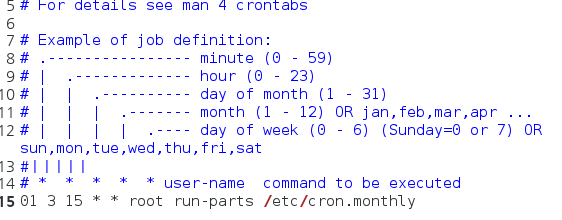
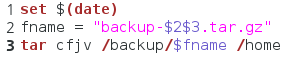
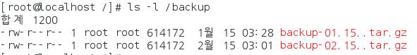
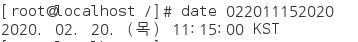
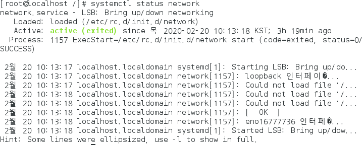
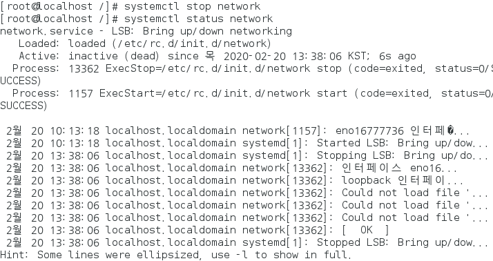

# linux 3

## 명령어

### root `/` 와`~`


### cron과 at (233p)

#### cron

* 주기적으로 특정 작업을 자동 수행해준다

* `crond.service`
* `[root@localhost ~]# gedit /etc/crontab ` 에서 설정 가능

---

##### cron으로 정기 작업 예약하기

1. ` gedit /etc/crontab ` 실행

!

* 분 / 시 / 일 / 월 / 년지정 
  
  * 매월 15일 3시 1분이 되면 root의 etc/crone.monthly를 실행한다
  
    

2. Mybackup.sh 생성/작성

* `[root@localhost ~]# gedit /etc/cron.monthly/mybackup.sh` 에 값 입력



* tar : 압축
  * c : 묶음 /  f : 묶음의 이름을 지정 / j : tar + bzip2 / v : 과정출력

* date의 값에서 2번째 3번째 요소를 가져와라
  * 내용은 압축해서 backup폴더에 넣음

3. my backup에 권한주기
   
* 읽게하기 위해서
   
   * `[root@localhost /]# chmod 744 /etc/cron.monthly/mybackup.sh`
   
4. 백업 폴더 만들기


5. 날짜 변경

* `date`
  * 시간을 알려줌
* `date(시간)`
  * 시간을 조작함
  * `[root@localhost ~]# date 01150300`

6. 재실행

* `[root@localhost ~]# systemctl restart crond`

7. 결과

* 

9. 시간 되돌리기

* 


##### at

* 예약 시간에 *한번*만 특정 작업을 수행해준다

* `atd.service`

---

##### at으로 작업하기

1. ``[root@localhost /]# at now + 2minutes``
   * 현재 시간에서 2분뒤에 작업 시행
2. `at> tar cfvj /backup/at.tar.xz /home
   at> <EOT>`
   * back에 압축
   * ctrl + d로 창을 빠져나온다


### 네트워크

#### 프로토콜

* 컴퓨터끼리 네트워크 상으로 의사소통을 하는 약속

#### http

* 웹을 사용하게 해주는 고급수준의 프로토콜
* 웹통신이 가능하려면 양쪽에 http 프로토콜이 설치되어 있어야 한다
  * window와 linux에는 기본적으로 설치가 되어 있다
* TCP/IP와 의존성
  * http를 이용하려면 반드시 TCP/IP가 있어야 한다

#### TCP/IP

* IP를 중심으로 네트워크를 연결해주는 저급수준의 프로토콜
* TCP :  통신의 전송/수신을 다룸
* IP : 데이터 통신을 다룸

#### 호스트이름 / 도메인 이름

* 호스트 이름 : 각각의 컴퓨터에 지정된 이름
* 도메인 이름 : 단체명.회사.지역 (hanbit.co.kr)
  * 같은 회사(도메인)에서 유일한 호스트

#### IP주소

* 네트워크에 연결된 모든 컴퓨터는 고유한 IP주소가 있음
* 특정컴퓨터의 IP주소를 알면 어디서든 접속이 가능하다
* 4바이트로 이루어져 있으며 각자리는 0~255까지의 숫자
  * 255.255.255.255 의 형식
* 자리수가 부족해서 IPV6이 나옴

#### 네트워크 주소

* 같은 네트워크에 속해 있는 공통 주소


 telnet : 원격으로 다른 컴퓨터를 접속하는 프로토콜 , 보안성은 약함

ssh : telnet을 보완하여 보안성이 강해짐, 하둡에서 사요된다


호스트이름 / 도메인 이름

* 네트워크 상에서 접근을 하려면 ip가 필요하다
  * ip  : 네트워크 컴퓨터 식별 변호 256.256.256.256가지 가능 (0~255까지 4자리)*
  * 아이피가 다 사용됨 -IPV4 -> IPV6등장 지금은 혼용해서 사용
* 서브넷 마스켓 :  네트워크 그룹을 나타냄
  * 255.255.255.0 : 똑같은 네트워크에 있음을 의미 


게이트웨이

* 


DNS

* domain name server
* 컴퓨터 ip(숫자)
* ip를 공개하는건 어려움 
* 상용화된 사이트를 ip를 대신하는 이름을 국제 단체에 등록
  * 우리 아이피 ~~~를 ``*.daum.net`으로 등록할게
* dns는 192.1658.111.2를 사용


#### 네트워크 관련 명령어

* ifconfig
  * 네트워크이름, ip, dns, g/w
* ifup
  * 네트워그 접속 (인터넷 접속)
* ifdown
  * 네트워크 다운 (인터넷 접속x)

#### 네트워크 관련 설정사항

* ``/etc/sysconf/network-scripts/ifcfg-enoxxx`
  * 네트워크, 맥어드레스, ip, g/w, dns 저장 파일
  * 인터넷이 안되면 가장 먼저 확인해야될 것
* `/etc/resolv.conf`
  * dns를 수정/추가할때 
* `/ect/hostname `
  * 도메인 수정 가능
* systemctl start network
* systemctl stop netwrok
* systemctl restart network
* systemctl status networt
  * 네트워크의 상태를 알려준다
  * 
  * ==Active : active== -> 정상작동중
  * systemctl stop netwrok 후 systemctl status networt
  * 

* `[root@localhost /]# cat /etc/sysconfig/selinux` 보안 관련 


#### 연산자 (252)

* 명령1|명령2

  * 명령1을 수행한 결과를 명령2에 저장

* `>` 리 다이렉션

  * 모든 터미널 명령은 표준입력 키보드, 표준출력 모니터인데 그것을 바꾸는 것
  * 파일내용 변경
  * 명령어 `>`파일명
    * 왼쪽에서 수행한 결과가 파일에 저장
  * `>>`
    * 기존 내용을 삭제하지 않고 저장 (추가)
  * `>`
    * 기존 내용을 삭제하고 저장

* grep

  * 파일에서 특정 문자열 검색

  * ````
    [root@localhost ~]# grep 'a' sample.txt
    
    [root@localhost ~]# grep '0-9' sample.txt
    
    [root@localhost ~]# grep '[a-zA-Z0-9]' sample.txt
    
    [root@localhost ~]# ls |grep link
    파일들 중(ls) link가 포함된 것 찾기 (grep link)
    
    [root@localhost ~] rpm -qa|grep gedit
    파일중에 gedit 있니
    
    ````

  * 

* find

  * 파일 검색

  #### | sort

  * 앞의 내용을 정렬


* echo

  * 키보드로 입력받고 결과를 모니터로 출력

  ````
  [root@localhost ~]# echo 'test' >>sample.txt
  test를 sample에 추가
  
  
  ````

  

* sort 

  * ```
    [root@localhost ~]# sort <sample.txt
    
    
    ```

  #### 프로세스, 데몬 서비스 (253p)

  #### 프로세스

* 하드디스크에 저장된 실행코드가 메모리에 로딩되어 활성화된 것

* 포그라운드 프로세스

  * 실행중이고 내 눈에 보인다

* 백그라운드 프로세스

  * 실행중이지만 내 눈에 보이지 않음

````
[root@localhost ~]# gedit /etc/passwd &
[1] 16344

[root@localhost ~]# jobs
[1]+  Running                 gedit /etc/passwd &

[root@localhost ~]# kill 16344
[1]+  종료됨               gedit /etc/passwd

````

* gedit을 실행하면 터미널실행 못함 
  * gedit은 포그라운드 프로세스다
* 이런 경우 뒤에 &를 넣으면 gedit를 백그라운드로 사용할 수 있다
* jobs를 입력하면 백그라운드에서 작성프로세서를 알려줌
  * [16334]는 프로세스 아이디
* kill 아이디 를 입력하면 강제삭제


* 프로세스 번호
  * 메모리에 로딩되어 활성화된 프로세스를 구분하려면 각각의 고유번호 필요
  * 할당된 고유번호

* 작업먼호
* 부모프로세스 / 자직 프로세스
* PS
* kill
* psree

* 서비스 : 백그라운드 동작 프로세스
* 항장 실행중인 서비스 : 데몬
* 필요 실행 서비스 : 소켓


````
[root@localhost ~]# ps -ef | grep gedit
root      16540   2607  3 14:44 pts/0    00:00:00 gedit /etc/passwd
root      16563   2607  0 14:44 pts/0    00:00:00 grep --color=auto gedit

````

* 16540 :  아이디
* 2607 부모 아이디 : 터미널(bash)창


##### jobs


---

## 톰캣 설치하기

#### 1. 파이어폭스 다운로드

* 파이어폭스 24.5버전 -> 72버전으로 다운로드
* 암축풀기

````
[root@localhost ~]# pwd
/root

[root@localhost ~]# cd 다운로드
[root@localhost 다운로드]# ls
apache-tomcat-9.0.30.tar.gz  jdk-8u241-linux-x64.tar.gz
firefox-72.0.2.tar.bz2       oracle-xe-11.2.0-1.0.x86_64.rpm.zip
hadoop-1.2.1.tar.gz

[root@localhost 다운로드]# tar xvf firefox-72.0.2.tar.bz2 

````

* 파이어폭스 권한

````
[root@localhost 다운로드]# ls -l
합계 636400
...
drwxr-xr-x 8 root root      4096  2월 20 15:08 firefox
...
````

* 프로그램설치는 usr로 이동한다

````
ip
[root@localhost 다운로드]# mv firefox /usr/local
[root@localhost 다운로드]# ls -l/usr/local
ls: 부적절한 옵션 -- '/'
Try 'ls --help' for more information.
[root@localhost 다운로드]# ls -l /usr/local
...
drwxr-xr-x  8 root  root  4096  2월 20 15:08 firefox
...
[root@localhost 다운로드]# ln -s /usr/local/firefox/firefox/usr/local/bin
파일만들기


````


* tomcat.apach.org 사이트에서 tar파일 다운로드
* download - tomcat9 - 

* `[root@localhost ~]# /usr/local/tomcat/bin/shutdown.sh `