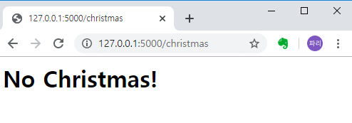
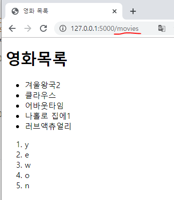
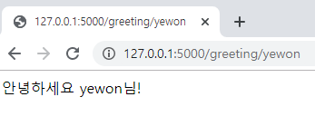
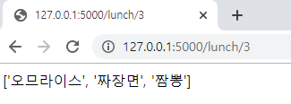
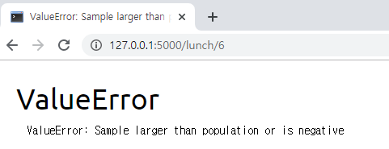
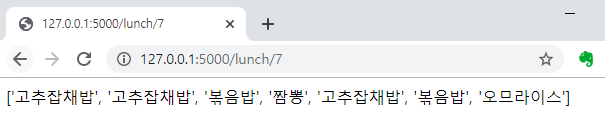

# Python 101


* dictionary 

  * dict = { key:value, ~~ }

    ```python
   dictionary = { 1 : "철수" , 2: "짱구", 3:"훈이"}
    ```

  * value 를 얻는 방법

    (1) `dict[key]`

    ​	- key가 없으면 error 발생
  
    (2) `dict.get(key)`
  
    ​	- key 가 없으면 none 출력

* List / String / Dictionary 의 size 
  
  * `len()`  함수 사용
  
* visual studio 단축키 
  * 행 복사 = shift + alt + 방향키
  * 행 삭제 = shift + delete 
  
  * control + shif + ~  (물결) 
  
    : visual studio code에 bash창 삽입

* print 
  - print( 변수 )
  - print( f" ~~~ { 변수 } " )
  - print("~~~{ }".format(변수,..))

* `sort()` 함수와 `sorted()` 함수의 차이.
  * list.sort() 함수는 list 자체를 정렬한다.
  * sorted(list) 함수는 list는 그대로 두고 정렬한 결과만 전달한다.


## 1. 저장

### 	1) 숫자

- 연산자 
  - a/b : 나누기
  - a//b : 몫
  - a%b : 나머지


### 2) 문자

* print format

  ```python
  name = 'yewon'
  age = 20
  text = "안녕하세요 저는 {}입니다. 나이는 {}입니다".format(name,age)
  print(text)
  
  f_text = f"저는 {name}입니다. 나이는 {age}입니다."
  print(f_text)
  ```

* string index

  ```python
  # string[start index :end index -1 까지]
  text_name = text[1:3]
  print(text_name)
  
  # split(변수) - 변수가 공백일 경우 띄어쓰기로 구분 
  text_sp = text.split('.')
  print(text_sp)
  ```

* string[ index ]

  * string_name[0] - 첫글자
  * string_name[-1] - 마지막 글자

## 2. 조건

* boolean type

  * 한국어 변수도 된다..! 

  ```python
  참 = True
  거짓 = False
  
  if 참 :
      print("참참참")
  if not 거짓 :
      print("거짓거짓")
  if 거짓:
      print("노노노")
      
  ====================
  참참참
  거짓거짓
  ```


## 3. 반복

* for 반복문

```python
menus = [1,2,3,4]

for menu in menus :
    print(menu)

print("===================")

for i in range(1,10,2):
    print(i)

print("===================")

for i in range(4):
    print(menus[i])

print("===================")

test = range(4)
for i in test:
    print(i)
```

```python
1
2
3
4
===================
1
3
5
7
9
===================
1
2
3
4
===================
0
1
2
3
```


##  4. Python 문법

### (**args)

> ** args는 변수의 개수가 몇 가지가 들어올지 모를 때 여러개의 변수를 받는 것을 의미한다.


### reqest Vs requests

* request  - python에서 http 통신을 하면서 주고 받는 인수를 처리하는 함수.

* requests 는 ( ex) flask  와 같은 외부라이브러리에서 사용하는 함수. 

  


# 문제 풀어보기

## Quiz ) 리스트 Str -> Int 변환해서 정렬하기

### 문제 5.

표준 입력으로 물품 가격 여러 개가 문자열 한 줄로 입력되고, 각 가격은 ;(세미콜론)으로 구분되어 있습니다.

입력된 가격을 높은 가격순으로 출력하는 프로그램을 만드세요.

\# 입력 예시: 300000;20000;10000;40000;20000

```python
prices = input('물품 가격을 입력하세요: ')
# 아래에 코드를 작성해 주세요.

price = prices.split(';') # str로 들어감 -> int로 변환이 필요함.

# 방법 1
price = [int(i) for i in price]
price.sort(reverse=True)

print(price)


# 방법 2
empty = []
for ps in price:
    empty.append(int(ps))
empty.sort(reverse=True)

print(empty)

======================================================
물품 가격을 입력하세요: 300000;20000;10000;40000;20000
[300000, 40000, 20000, 20000, 10000]
[300000, 40000, 20000, 20000, 10000]
```


# Python Flask - 간단 웹 프레임워크

> Flask는 Python으로 구동되는 웹 어플리케이션 프레임워크이다. 
> Django 프레임워크보다 가볍고, 스케일아 작은 서버부터 스케일 큰 서버를 만들 수가 있으며, `Jinja`와 `Werkzeug`를 포함하고 있다.


## 1. Flask 설치

```bash
# Flask 설치
$ pip install flask

# Flask 확인
$ flask --version
```


## 2. Flask 어플리케이션 만들기

> @app.route( / link ) 로 api를 만든다.

``` bash
< app.py >

from flask import Flask

app = Flask(__name__)

@app.route('/')
def index():
    return 'Hello Flask'

@app.route('/info')
def info():
    return 'Info'
```


### 3. Flask 서버 구동 확인하기

>CLI환경에서 해당폴더에서 `flask run` 입력하고, 
>Chrome에서 `http://127.0.0.1:5000/`으로 접속하면 된다. 
>info 라우터를 확인하려면 `http://127.0.0.1:5000/info/`에 접속하면 확인 가능하다.


예시 코드>

```python
from flask import Flask
import datetime 
#지금부터 flask 서버의 이름이 app
app = Flask(__name__)

#url를 관리해주는 친구 >app.route('/')
@app.route("/") 
def hello():
    return "안녕!!"


@app.route("/dday")
def dday():
    today = datetime.datetime.now()
    print(today)
    final = datetime.datetime(2020,6,9)
    
    result = final - today
    return f"{result.days}일 남았습니다"


# is it christmas ? 라우터 만들기
# "/christmas"
@app.route("/christmas")
def christmas():
    today = datetime.datetime.now()
    #xmas = datetime.datetime(2019,12,25)
    
    real_month = today.date().month
    real_day = today.date().day

    print(f"{real_month}월 {real_day}일 ")

    if real_month == 12 and real_day == 25:
        return "Christmas Yes!"
    else :
        return "No Christmas!"

#flask run - flask 에서 제공하는 run
# Debug 모드  >python app.py
if __name__ =="__main__":
    app.run(debug=True)

=================================================================
$ python app.py 

```




## 4. 템플릿 추가하기

>  폴더 내에 `templates` 폴더를 추가하고, `index.html`과 `info.html` 파일을 추가한다.

* templates 폴더 이름 틀리면 안된다!


### (1) app.py 에 템플릿 코드를 추가한다.

```python
from flask import Flask, render_template
app = Flask(__name__)

@app.route('/')
def index():
    return render_template('index.html')

@app.route('/info')
def info():
    return render_template('info.html')


# html 넘겨주는 파일 만들기
@app.route("/movies")
def movies():
    movies=["겨울왕국2","클라우스","어바웃타임","나홀로 집에1","러브액츄얼리"]
    names = ["y","e","w","o","n"]
    return render_template("movie.html",movies = movies ,names = names) 
    # movie.html 의 movies 에 = 함수내에서 사용하고 있는 movies를 보내겠다.

    
# 디버그모드 main은 코드 맨 아래 있어야 한다. 
if __name__ =="__main__":
    app.run(debug=True)

```


### (2) Templates 폴더에 파일을 추가한다.

< templates/movie.html >

* `! + tab` 하면 큰 틀 자동완성

```html
<!DOCTYPE html>
<html lang="en">
<head>
    <meta charset="UTF-8">
    <meta name="viewport" content="width=device-width, initial-scale=1.0">
    <meta http-equiv="X-UA-Compatible" content="ie=edge">
    <title>영화 목록</title>
</head>
<body>
    <h1>    
        영화목록
    </h1>
    <ul> <!-- ol 태그는 순서를 만든다. ul 태그는 * 를 만든다 -->
        <!-- Flask 의 Jinja 문법 : python 문법 사용가능 -->
        
            <li> {{ movie }} </li>
        
    </ul>

    <ol>
        
            <li> {{ name }} </li>
        

    </o1>
</body>
</html>
```


< 실행결과 >




## 5. dynamic Url Parameter

> 기본적으로 Url parameter는 String의 값으로 들어오고,
>
> 반환값도 String이다.


* url 로 부터 값을 받아 사용할 수 있다.

```python
@app.route("/greeting/<name>")
def greeting(name):
    return f"안녕하세요 {name}님! "
```



### Url Parameter Type

> type error 에 따라 변수타입을 주의해서 맞춰줘야한다. 

* Error 발생 경우

```python
# 1 case
@app.route("/cube/<int:num>")
def cube(num):
    result = num**3
    return result
==========================================
TypeError
TypeError: The view function did not return a valid response. The return type must be a string, dict, tuple, Response instance, or WSGI callable, but it was a int.

--------------------------------------------------

# 2 case
@app.route("/cube/<num>")
def cube(num):
    result = num**3
    return str(result)

=============================================
TypeError
TypeError: unsupported operand type(s) for ** or pow(): 'str' and 'int'

```


< 옳은 코드 >

* 산수연산을 위해 int 타입으로 변수를 정의한다.
* 반환값은 String을 맞추기 위해 str로 형변환한다.

```python
#return타입은 str
@app.route("/cube/<int:num>")
def cube(num):
    result = num**3
    return str(result)
```


#### 활용예제

* 점심메뉴를 랜덤하게 전달하는 개수(num)만큼 출력하기 

  

  1번 풀이로 하면 간단하지만 num숫자가 메뉴 숫자보다 커지면 안된다는 단점이 있다.

  * **random() 함수가 중복을 허용하지 않는다는 점 때문이다.**

```python
from flask import Flask
import random

#지금부터 flask 서버의 이름이 app
app = Flask(__name__)


# 1번 풀이
@app.route("/lunch/<int:num>")
def lunch(num):
    menu_list = ["짜장면","짬뽕","오므라이스","볶음밥","고추잡채밥"]
   # 순회가능한 모든 변수가 올 수 있다.
    result = random.sample(menu_list,num)
    return str(result)

```

​						< 중복이 제거된 랜덤하게 뽑힌 결과 >




< 그러나 메뉴리스트보다 인원수가 넘어가면 에러가 발생한다.  >




* 1번 풀이의 단점을 극복하기 위해 새로 2번 풀이를 작성했다.

```python
# 2번 풀이
@app.route("/lunch/<int:num>")
def lunch(num):
    menu_list = ["짜장면","짬뽕","오므라이스","볶음밥","고추잡채밥"]

    result = [] 
    for i in range(num):
        result.append(random.sample(menu_list,1))
    
    answer = sum(result, [])

    print(result)
    return str(answer)
```



