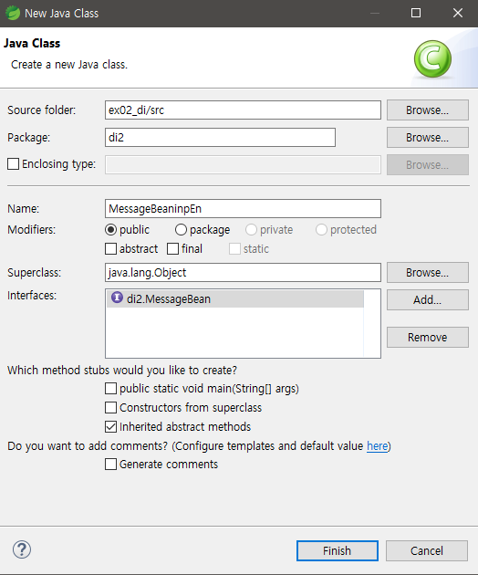
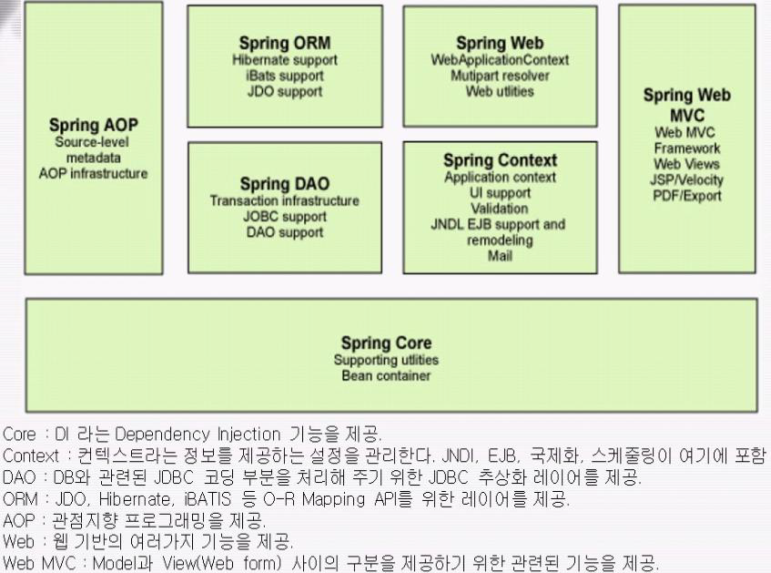

01.24

---

정적웹페이지

JS가 없는 HTML, CSS

동적작동 - JS 포함된 코드 요새는 다 동적 웹

1. 서블릿 : JAVA 안ㅇ ㅔHTML이 있는 것
2. JSP : HTML 속 JAVA : 모델 1
3. 모델2 : MVC

스프링은 : 모델1과 모델2를 지원해주는 툴


---

DI


---

AOP


---

클래스 생성

서로다른 클래스 간에는 MainEntry 

* MainEntry

````java
public static void main(String[] args) {
	}
````

* 메인엔트리에서부터 코드가 시작
* 여기서 함수, 객체생성을 해야한다


---

### 프로그램 품질 관리

* 가장 품질이 좋게 만들기 위한 것

1단계 : 응집도는 높게 결합도는 낮게

* 우리집 공사를 하는데 남의 집이 무너진다?
  * 결합도가 높은것!
  * 내 소스를 건들였는데 남의 소스까지 엉켜지는것
  * 인터페이스를 써서 결합도를 낮춘다


---

## 인터페이스와 상속

* 품질 상승을 위해 인터페이스 기법을 써서 개발을 함
* 확장이 좋아지며 결합도를 낮출 수 있다

#### 인터페이스 생성


#### 인터페이스 상속



* add를 통해 추상메소드를 import 할 수 있다


---

### DI

* 생성자 함수 사용 (constructor)
* setter 메소드를 사용
  * ==setter메소드 사용을 권장함==
* 객체생성 
  * JAVA = new
  * Spring =<bean> 태그


---

IoC Container꺼내는 방법

* Maven Project로 변경
* pom.xl이 생성됨
* add Spring nature로변경

* main이 



의존성 주입을 위한 DI

DI는 코어임

bean container - core / aplication,.,?

core 관련 jar 파일이름은 Spring context

aop관련 일할하면 관련 api 넣어야 함


1. MavenRepository 접속 - spring context
   * 많이 쓰는 ver : 4.1.7
   * 메이븐 소스 복사
   * `pome.xml- <build>` 사이에 붙여넣기

* 