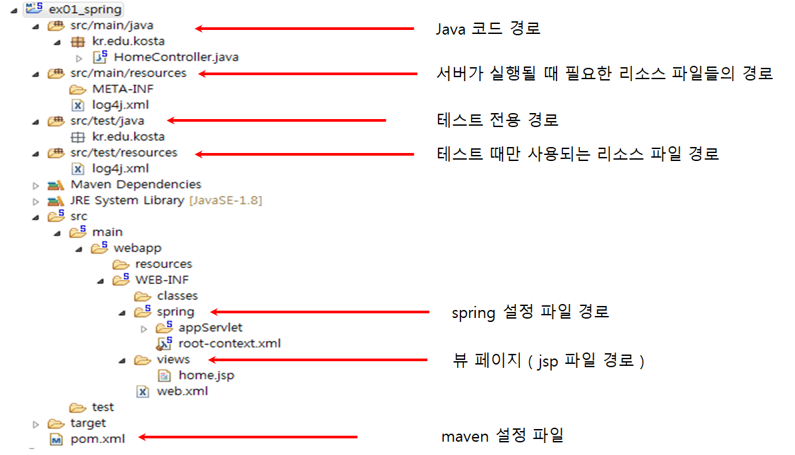

# SPRING

* 이클립스와 SPRING 워크스페이스는 다르게 설정한다
  * 충돌의 위험이 있음!
* 추천도서
  * 코드로 배우는 스프링 웹 프로젝트
* 스프링 프레임워크에는 Web-INF/views/ + home + jsp 를 걸합시키는 역할을 함 

## SPRING 의 기본

### SPRING탄생배경

* 경쟁사 ejb에 대해 경량의 프레임워크
  * 내가 만든 코드를 도와주는 개념에서 바꿔벌임..
  * 내가 제어하는 것이 아님
* EJB가 겨울이면 SPRING은 봄이야 ^^!
* 내가 만든 코드가 코드에 끼어들어가서 실행됨

### .m2 (MAVEN)

* Maven2의 약자

* 프로젝트 관리해주는 도구

  * 자바 프로젝트의 빌드를 자동화 해주는 빌드 툴

* jar파일을 모음

* MAVEN_HOME/conf/ **settings.xml**

  * maven 자체에 관련된 설정

* POM.xml

  * Project Object Mode, 프로젝트 내 빌드 옵션을 설정하는 부분

  #### 장점

  1. 라이브러리 관리 용이
  2. 프로젝트의 작성부터 컴파일, 페트스 등 프로젝트 라이프사이클에 포함되는 각 테스트를 지원
  3. war파일 기반의 배포용으로도 자주 사용

  

#### LifeCyclee

* 메이븐은 프레임워크기 때문에 동작 방식이 정해져 있음
* 라이프사이클 : Build의 순서
* Build : 일련의 Pharse(단계)에 연계된 Goal을 실행화는 과정
* **Maven build :** 메이븐 빌드를 실행한다.
* **Maven build.... :** 새로운 사용자 빌드를 만든다.
* **Maven clean :** target에 지정된 모든 소스를 삭제한다.
* **Maven generate-sources :** 컴파일 과정에 포함될 소스를 생성한다.
* **Maven install :** Local Repository에 패키지를 복사한다.

### Spring MVC

1. 클라이언트로부터 모든 ".do" 요청을 DispatcherServlet이 받음
2. DispatcherServlet은 HandleMapping을 통해 요청을 처리할 Controller을 검색
3. DispatcherServlet은 검색된 Controller를 실행해 클라이언트의 요청 처리
4. Controller는 비즈니스 로직의 수행 결과로 얻어낸 Model 정보와 Model을 보여줄 View 정보를 ModelAndView 객체에 저장해 리턴
5. DispatcherServlet은 ModelAndView로부터 View 정보를 추출하고 ViewResolver를 이용해 응답으로 사용할 View를 얻어냄
6. DispatcherServlet은 ViewResolver를 통해 찾아낸 View를 실행해 응답 전송

* 보통 제작과정에선 Controller와 View를 사용 (나머지는 SPRING 내장)

### 프레임워크

* 개발자를 도와주기 위한 도구
* 뼈대, 틀,아키텍처,골격코드
* 아키텍처(골격코드) 제공
  * 아키텍처 : 애플리케이션의 구조를 결정함
  * 유지보수에 용이
* SPRING은 IoC와 AoP를 지원하는 경량의 컨테이너 프레임 워크

### AOP

* 관점지향 프로그래밍
* 기능을 *핵심비즈니스 기능*과 *공통기능* 으로 구분하고 공통기능을 개발자의 ==코드 밖==에서 필요한 시점에 적용하는 프로그래밍 방법

### Inversion of Control, IOC(제어의 역전)

* 메소드나 객체의 호출작업을 개발자가 결정하는 것이 아니라 ==외부에서 결정되는 것==을 의미 
* 애플리케이션을 구성하는 객체간 낮은 결합도 유지
* 필요한 부분을 개발해서 끼워넣기식의 개발
  * 최종 호출은 개발자에 의해서가 아닌 프레임워크의 내부에서결정된대로 이루어짐 
* 인스턴스의 생성부터 소멸까지의 객체 생명주기 관리를 개발자가하는 대신 스프링(컨테이너)가 관리

### Dependency Injection (DI, 의존성 주입)

* IoC를 실제로 구현하는 방법
* 의존성 있는 컴포넌트들의 간의 관계를 개발자가 직접 코드로 명시할 필요 없음
  * 컨테이너인 Spring이 런타임에 찾아서 연결해줌
  * 의존적인 객체 직접 생성/제어X

* 클래스의 기능을 추상적으로 묶어놓은 인터페이스를 가져다씀
* 모듈간의 결합도가 낮아지고 유연성이 높아짐

### Spring bean

* 스프링 설정파일에 클래스를 등록하기 위해 사용

* 애플리케이션의 핵심을 이루는 객체

* Spring IoC 컨테이너에 의해 인스턴스화,관리,생성됨

* 일반적으로 XML 파일에 정의한다.

* 주요 속성

  * class(필수): 정규화된 자바 클래스 이름
  * id: bean의 고유 식별자
  * scope: 객체의 범위 (sigleton, prototype)
  * constructor-arg: 생성 시 생성자에 전달할 인수
  * property: 생성 시 bean setter에 전달할 인수
  * init method와 destroy method

  

### POJO

* sprnig은 평범한 pojo를 사용하면서 기존의 EJB에서만 가능했던 일들을 가능하게 함
  * EJB를 사용했을 때엔 복잡도가 높고 비용도 높났음

* 평범한 옛날 자바 객체

* NotPOJO 클래스

  * Servlet
    * 우리 마음대로 만들 수 없음
    * Servlet에서 요구하는 규칙에 맞게 클래스 생성해야함

### Aspect Oriented Programming(AOP, 관점 지향 프로그래밍)

* 핵심 비즈니스 로직과 각 비즈니스 메소드마다 반복해서 등장하는 공통 로직을 분리해 응집도가 높게 개발할 수 있도록 함

* 공통으로 사용하는 기능을 외부 독립 클래스로 분리

  * 응집도가 높은 비즈니스 컴포넌트 만듦
  * 유지보수 향상

* Crossutting Concerns (흩어진 관심사)를 Aspect로 모듈화 하고 핵심적인 비즈니스 로직에서 분리해 재사용하는 것

  * 모듈화 : 공통된로직이나 기능을 하나의 단위로 묶음

  

## 생성

#### 스프링 레거시 프로젝트

* 마켓플레이스
  * String Tool 3 Add-On for Spring 다운로드

* File -new - other - Spring - Sprinf Legacy Project
  * Sprinb MVC Project 선택(프로젝트시)
    * ==이 구조를 만들어주는게 메이븐!==
  * Package의름은 3단까지 작성해야됨
    * 사이트 주소의 이름을 거꾸로 작성이 기본
      * ex) `kr.sds.edu` ->*groupID*라고 부름

#### 기본 설정

* 언어 UTF-8

#### 서버 연결

* spring에는 자체적으로 서버가 있지만 Tomcat이용
* run - tomcat8.0 -tomcat폴더선택

## 폴더 설명

## 어노테이션

#### @Controller

* Controller의 역할을 함

#### @RequestMapping

* ??

---

##Spring DI