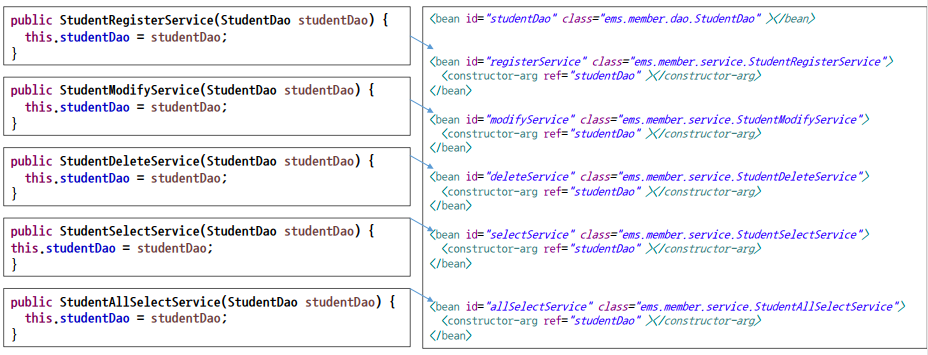
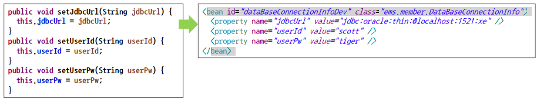
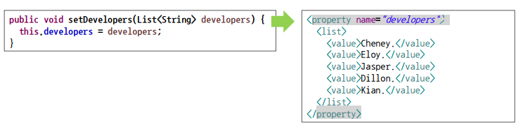
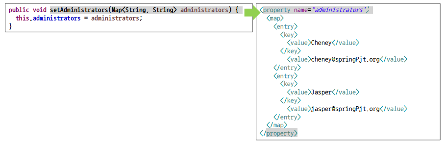

# DI

* Dependency Injection / 의존 주입

* oop에서 방법론중의 하나
  * spring은 DI를 채택해서 사용하는 것
* 객체가 프로젝트에 구속이 되어 있으면 객체 하나를 바꾸기 위해 프로젝트를 새로 해야함

### 장난감 예시

1. 베터리 일체형

   * 공장에서 생성 될 때 베터리를 가지고 나옴

   * 베터리가 떨어지면 장난감을 새로 구입해야 함

   ````java
   public class ElectronicCarToy{
       private Battery battery;
       public ElectronicCarToy(){
           //생성자를 이용해 베터리 주입
           battery = new NormalBattery;
       }
   }
   ````

2. 베터리 분리형(1)

   * 베터리가 떨어지면 베터리만 교체

   ````java
   public class ElectronicRobotToy{
       private Battery battery;
       public ElectronicRobotToy(){
           
       }
       public void setBattery(Battery battery){
           //setter를 이용해 베터리 주입
           this.battery = battery;
       }
   }
   ````

   

2. 베터리 분리형(2)

   * 공장에서 생성 될때 베터리를 가지고 나옴 
   * 베터리가 떨어지면 베터리만 교체

   ````java
   public class ElectronicRadioToy{
       private Battery battery;
       public ElectronicRadioToy(Battery battery){
           //생성자를 이용해 베터리 주입
           this.battery = battery;
       }
       public void setBattery(Battery battery){
           //(교체를 원할경우) setter를 이용해 베터리 주입
           this.battery = battery;
       }
   }
   ````

   

* 장난감들은 다 베터리에 의존한다
  * 베터리 교체가능 /불가능 둘 다 베터리(객체)가 있어야만 완벽한 장난감이 됨
  * ==베터리에 의존한다== 의존주입, DI 
* DI일 경우 객체를 분리해야 한다
  * 베터리 분리형이 더 효율적
  * 필요한 것(베터리)만 교체해서 사용할 수 있다
  * 일반적으로 자주쓰는 것은 생성자/setter 둘 다 있는 방식
  * 첫번째 (생성자만 있는 경우)는 좋지 못한 프로그램

> 보통 객체 안에 또 다른 객체가 있는 경우 DI가 형성되었다고 하며 Spring에서는 SpringContainer(스프링 설정파일) 안에서 객체를 만들어 서로 의존하게 한다


### DI 설정 방법

#### 생성자를 이용한 의존 객체 주입



````xml
<bean id = "" class=""><constructor-arg ref=""/></bean>
````

#### setter를 이용한 의존 객체 주입



````xml
<bean id = " "class = " ">
    <property name = "" value = "" />
    <property name = "" value = "" />
</bean>
````


#### List타입 의존 객체 주입



````xml
<property name ="">
    <list>
    <value>내용</value>
    <value>내용</value>
        
    </list>

</property>
````


#### Map타입 객체 주입



```xml
<property name = "">
    <map>
    	<entry>
            <key>
            	<value>내용</value>
            </key>
    	</entry>
            	<entry>
            <key>
            	<value>내용2</value>
            </key>
    	</entry>
    
    </map>

</property>
```


### Spring 설정 파일 분리

* 스프링 설정파일을 효율적으로 관리하기 위해 파일을 분리
* 보통 기능별로 분류한다
  *  ex) dao와 서비스 객체 / 데이터 베이스 관련 객체 / InfoService 관련 객체.... 

#### 방법 1

* 배열을 이용한 방식 (자주 사용되는 방식)

* xml을 기능별로 분류한 후 main class에서 배열에 저장한다

  ````java
  		String[] appCtxs = {"classpath:appCtx1.xml", "classpath:appCtx2.xml", "classpath:appCtx3.xml"};
  		GenericXmlApplicationContext ctx = 
  				new GenericXmlApplicationContext(appCtxs);
  ````

#### 방법 2

* import를 활용한 방식

* xml파일에서 다른 파일들을 import를 한다

* main class에서는 import를 받은 xml파일만 적으면 됨

  ````xml
  	<import resource="classpath:appCtx2.xml"/>
  	<import resource="classpath:appCtx3.xml"/>
  ````

  


### bean의 범위

#### Singleton

* default

* new로 객체를 생성하는 경우 메모리에 항상 새로운 객체가 생성됨

  * new Class a != new Class a 

* Spring의 경우 xml을 가지고 컨테이너를 이용해 객체를 미리 만들어 놓음

  * getBean("A") = getBean("A")

    

> 스프링 컨테이너에서 생성된 Bean 객체의 경우 동일한 타입에 대해서 기본적으로 한개만 생성이 되며getBean()메소드로 호출될 때 동일한 객체가 반환 된다


#### Prototype

* 싱글톤 버위와 반대의 개념

* 호출할 때마다 다른 객체가 생성되길 바랄 때 사용

````xml
<bean id = "" class = "" scope ="prototype">

</bean>
````

---

### 의존객체 자동 주입

* 스프링 설정 파일에서 의존 객체를 주입할때 ` <constructor-org>`나 `<property>`태그로 의존 대상 객체를 명시하지 않아도 *스프링 컨테이너*가 자동으로 필요한 이존 대상 객체를 찾아서 의존 대상 객체가 필요한 객체에 주입해줌

#### @Autowired

* 주입하려고 하는 객체의 타입이 일치하는 객체를 자동으로 주입
* default 생성자가 있어야 사용 가능
* 객체가 여러개 있는 경우  Autowired가 있는 객체를 찾아서 알맞은 데이터를 주입

#### @Resource

* 객체의 동일한 이름을 찾아서 감
* 생성자에는 사용이 불가능하고 Property나 Method에서만 사용이 가능하다

```xml
<bean id="wordDao" class="com.word.dao.WordDao" >
</bean>
```

````java
@Resource
private WordDao wordDao;
````


### 의존객체 선택

* 동일한 데이터 타입의 bean 객체가 있을 경우 Spring Container에 혼란이 옴
  * 동일한 객체가 두개이상인 경우 Spring Container는 자동주입 대상 객체를 판단하지 못해 Exception 발생 

#### @Qualifier

* 동일한 객체가 여러개 있으면 이 아이디를 가진 애를 우선적으로 쓰겠다
* 어노테이션에 아이디를 적으면 됨

````xml
<bean id="wordDao" class="com.word.dao.WordDao" >
		<qualifier value="usedDao"/> 
    <!-- 여러개 객체를 사용할때 우선순위를 주는 것 -->
</bean>
````

````java
@Autowried
@Qualifier("usedDao")
code..
````

### 자동 주입 체크

* 의존객체 자동 주입을 어노테이션 했을 때 찾는 bean 객체가 없을 때 exception을 발생시키지 않기
  * java의 Autowired에 fale 주기

````java
@Autowired(required = false)
//의존객체가 있을 경우 주입하고 없으면 말기
````


#### @Inject

* @Autowired와 거의 비슷하게 @Inject 어노테이션을 이용해 의존객체를 자동으로 주입
* Autowired의 경우 required 속성을 이용해 의존객체 대상 객체가 없어도 exception 피할 수 있음
* @Inject의 경우 required 속성 지원 안함 
* 좀 더 간단함

````java
@Inject
@Named(value="wordDao1")
private WordDao wordDao;
	
````

````xml
<bean id="wordDao1" class="com.word.dao.WordDao" />
````


---


학사관리-- 프로그램


main

배열로 학생번호,id,pw,이름, 나이,성별,전공입력

학생정보를 객체화 - assembler

<

assembler

studebtDao 클래스 생성

등록

수정

삭제

선택

전체선택 하는 객체를 만듦>

등록서비스로 생성함

for문으로


---

DAO database access object

데이터베이스와 통신을 ㄷ고와주나

db를 다루지 않기 때문에 map으로 데이터를 쌓음


assemb

dao를 하나 만들어서

dao를 다른객체 만들때 다 주입을함

-> 다른객체들은 dao에 의존하고 있다

-> 의존주입!!

그래서 dao의 map객체를 db로 사용할 수 있게 됨

---

xml

dao객체 만듬

register서비스

수정 삭제.. 객체 만듦 만들때 ref studentdao로 참조

<constructor-arg ref="studentDao" ></constructor-arg>

resistservece = new studentservice(studentdao)를 대신함

---

생성자를 이용한 의존 객체 주입 : id를 이용

constructor-arg : 주입하려는 객체를 넣어주면됨

setter를 이용한 의존객체 주입

property name : setter의이름

value : 파라미터로 들어오는 값

id규칙 setter일경우 setJdblUrl -> 변경 jdbcUrl

---


---


---

