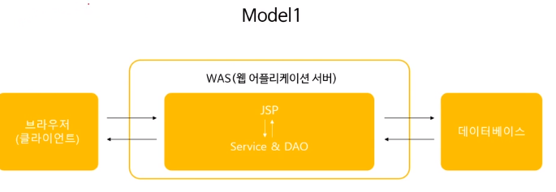
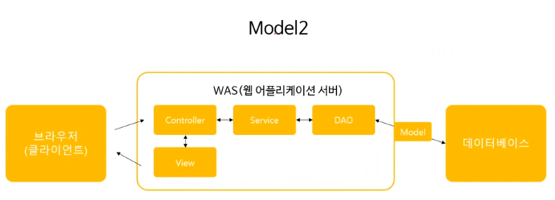
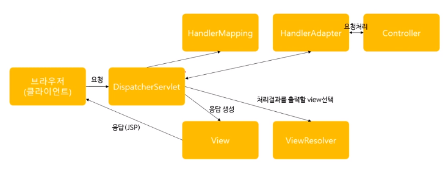
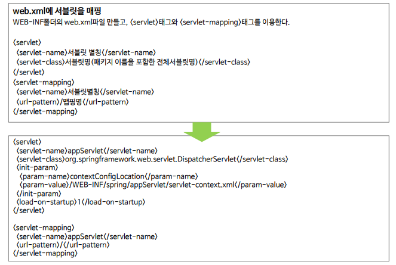
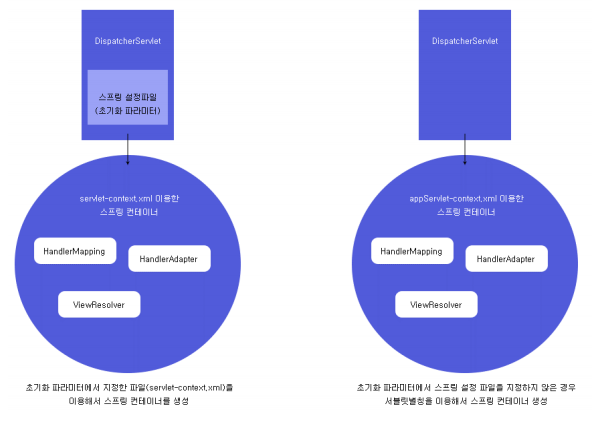
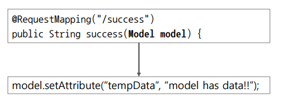
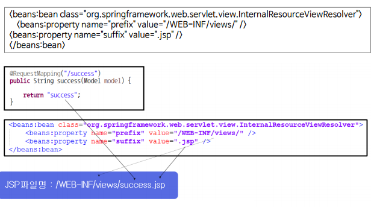
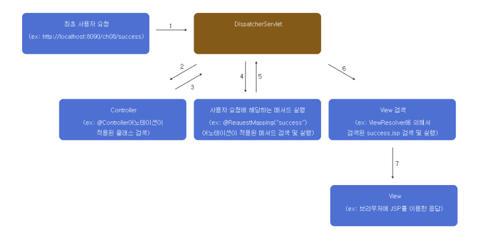

# 5.웹프로그래밍설계모델

* Spring을 이용한 웹프로그래밍 설계
* Spring MVC프레임워크 기반의 웹프로그래밍 구조

### 설계모델

웹프로그래밍의 모델  : model1, model2

#### model1



1. 클라이언트가 브라우저를 이용해 리퀘스트를 요청한다
2. 웹어플리케이션서버(WAS)를 통해 처리한다
3. DB에 접근해서 정보를 가져온다
4. 가져온 정보를 WAS에서 가공한다
5. 가공한 값을 클라이언트에게 전달

* WAS에 JSP와 Service와 DAO를 하나의 파일로 처리했다
* HTML안에 각종 java태그들을 넣어서 개발 속도가 빠르다
* 여러가지 언어를 하나의 문서에 넣기 때문에 유지보수가 어렵다

#### model2



* model2 : model1의 단점을 보안

1. 클라이언트가 브라우저를 이용해 리퀘스트를 요청한다
2. controller가 요청을 받고 어떤 Service에 줄지 결정함
   * Service안에는 여러가지 서비스가 존재함
3. Service를 통해 DAO - Model을 통해 DB에 접근
4. View(Jsp파일)을 통해 클라이언트에게 전달

* 각각의 기능들을 나눔
* 모든걸 컨트롤 : Controller
* 실질적인 기능 : Service
* DB값을 꺼냄 : DAO
* 유지보수가 수월하다


### 스프링 MVC 프레임워크 설계 구조



1. 클라이언트가 요청을 함
2. DispatcherServlet이 요청을 받으면 HandlerMapping에게 바로 전달
3. HandlerMapping을 통해 적합한 Controller가 있는지 찾은 후 DispatcherServlet에게 전달
4. DispatcherServlet은 HandlerAdapter를 통해 특정 Controller내의 가장 적합한 메소드를 찾는다
5. 메소드 실행후 관련된 model데이터를 가져온다
6. ViewResolver : 작업이 끝난 후 적합한 jsp문서를 찾는다
7. dispatcherservlet이 view를 통해 클라이언트에게 jsp를 전달


#### DispatcherServlet



* DispatcherServlet은 내가 코딩을 하는 것이 아니라 설정만 하는 것이다
* 매핑명은 `/`로 한다 
  * DispatcherServlet은 가장 처음 받는 것이기 때문

1. DispatcherServlet을 서블릿으로 등록(이름설정)
2. init-Pram을 통해 스프링 컨테이너 생성
3. 스프링컨테이너가 생성되면 adapter와 resolver가 생성됨

##### 스프링 설정파일 명시

* pram-name/pram-value로 명시함(주로 사용)
* 명시를 안하는 경우 Spring이 알아서 스프링컨테이너를 생성함
* 


### Controller 객체

* 개발자 구현부

#### @Controller

* HandlerAdapter는 컨테이너에서 자동으로 만들어 줌
  * 그걸 받아오는 Controller는 개발자가 구현해야함
* servlet-context.xml

````xml
<annotaion-driven/>
````

* controller.java

````java
@controller
public calss HomeController{
    ...
}
````

#### @RequestMapping

* Controller에서 적합한 메소드를찾는다
* 사용자가 success로 접근을 했을 때
  * RequestMapping을 통해 success를 찾은 후 관련 메소드 실행
  * return으로 success.jsp 파일을 찾아온다

````java
@RequestMapping("/success")
public String seccess(Model model){
    return "success";
}
````


#### Model타입의 파라미터



* 개발자는 Model객체에 데이터를 담아 DispatcherServlet에 전달할 수 있음
* DispatcherServlet에 전달된 Model데이터는 View에 가공되어 클라이언트에 응답처리


### View 객체

* ViewResolver는 알아서 만들어짐
* view는 개발자가 직접 만들어야 함




### 전체적인 웹 프로그래밍 구조



1. 사용자가 success를 요청함
   * DispatcherServlet이 받음
2. handlermapping이 Controller를찾음  
   *  Controller는 @Controller로 만듦
3. 찾은 후 DispatcherServlet으로 되돌아감
4. HandlerAdapter를 통해 적합한 메소드를 찾아감 
   * @requestMapping으로 메소드실행
5. 모델/뷰 형태로 DispatcherServlet으로 되돌아감
6. ViewResolver로 사용자에게 적함한 뷰 찾기
7. jsp를 이용한 응답