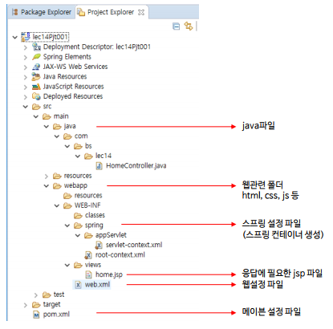
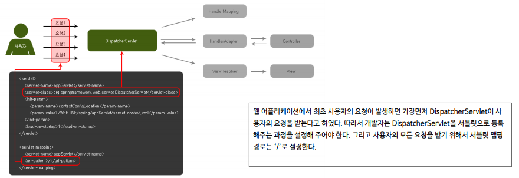
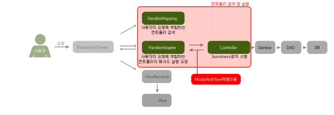
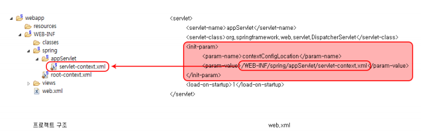
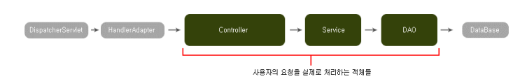
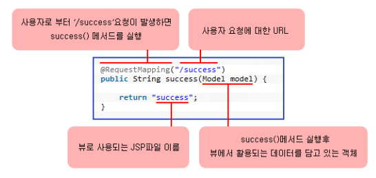

# SpringMVC

### 웹서버 다운로드 (TOMCAT) / 이클립스 연동

* 로컬에서 서버를 만들 예정

##### 서버 연동

* Server-NewServer-Tomcat v8.5(버전에맞게)
* 경로 : 톰캣이 위치한 경로
* JRE : jre1.8.0_241 (버전에 따라 다름)

##### 서버설정

* 더블클릭하면 설정창이 뜸
* Server Locations
  * Use Tomcat installation
* Server Option
  * publish modul contexts to seperate XML files 추가클릭
* Ports
  * HTTP/1.1의 PortNumber를 8090으로 변경
  * ORACLE과의 충돌을 피하기 위해
* publish to the server 클릭
  * 콘솔창에 위치
  * 톰캣서버와의 동기화를 위해
* 서버실행 후 인터넷 창에 localhost:8090을 눌러서 톰캣화면이 뜨면 성공
* 내 아이피 = 127.0.0.1 = localhost

### STS 설치

* MarketPlace에서 STS (Spring Tool Suit) 설치

### 웹프로젝트 생성

* new - other -Spring - Spring Legacy Project - Spring MVC projectc체크

* 자동으로 pom.xml 등 필요한 요소들이 설치된다
* 실행 : Run on Server로

+ 웹프로젝트 생성

### 웹 프로젝트 분석



##### JAVA 파일

* JAVA 파일들이 위치한다
* 주로 패키지로 묶어서 관리한다
* 웹 애플리케이션에 사용되는 Controller, Service, DAO 객체들이 위치

##### webapp

* 웹과 관련된 파일들(스프링 설정파일, JSP파일. HTML파일등)이 위치

##### resources

* JSP파일을 제외한 html, css, js파일 등 위치

##### Spring

* 스프링 컨테이너를 생성하기 위한 스프링 설정파일 위치
  * Servlet-context.xml

##### views

* view로 사용될 JSP파일 위치

##### web.xml

* 웹을 설정해주는 파일
* DispatcherServlet 설정코드 

##### pom.xml

* 메인 레파지토리에서 프로젝트에 필요한 라이브러리를 내려받기 위한 메이븐 설정 파일

### web.xml



* web.xml에서 DispatcherServlet을 등록함
* 서블릿을 설정할때 경로를 /로 해줘야함
  * 모든 요청을 받아야 하기 때문

### DispatcherServlet



1. 사용자의 모든 요청을 DispatcherServlet이 받음
2. HandlerMapping 객체에 Controller 객체 검색 요청
3. HandlerMapping 객체는 프로젝트에 존재하는 모든 Controller 객체 검색
4. HandlerMapping 객체가 Controller객체를 검색해 DispatcherServlet객체에 알려줌
5. DispatcherServlet 객체는 HandlerAdapter 객체에 사용자의 요청에 부합하는 메소드 검색 요청
6. HandlerAdapter 객체는 사용자에 부합하는 메소드를 찾아서 Controller객체의 메소드 실행
7. Controller 객체의 메소드가 실행된 후 Controller객체는 HandlerAdaper 객체에 ModelAndView 객체 반환
   * ModelAndView 객체에는 사용자 응답에 필요한 데이터 정보, JSP파일이 담겨 있음
8. HandlerAdapter 객체는 ModelAndView 객체를 다시 DispatcherServlet 객체에 반환

### Servlet-context.xml



* DispatcherServlet이 서블릿으로 등록될 때  
  * ContextConfigLocation이름으로 초기화
  * 파라미터를 Servlet-context.xml로 지정
    * 이 파일이 스프링 설정의 역할을 함
* 클래스로부터 객체(bean)을 생성하고 조립하는 역할

````xml
<?xml version="1.0" encoding="UTF-8"?>
<beans:beans xmlns="http://www.springframework.org/schema/mvc"
	xmlns:xsi="http://www.w3.org/2001/XMLSchema-instance"
	xmlns:beans="http://www.springframework.org/schema/beans"
	xmlns:context="http://www.springframework.org/schema/context"
	xsi:schemaLocation="http://www.springframework.org/schema/mvc https://www.springframework.org/schema/mvc/spring-mvc.xsd
		http://www.springframework.org/schema/beans https://www.springframework.org/schema/beans/spring-beans.xsd
		http://www.springframework.org/schema/context https://www.springframework.org/schema/context/spring-context.xsd">

	<!-- DispatcherServlet Context: defines this servlet's request-processing infrastructure -->
	
	<!-- Enables the Spring MVC @Controller programming model -->
    <!--어노테이션용 -->
	<annotation-driven />

	<!-- Handles HTTP GET requests for /resources/** by efficiently serving up static resources in the ${webappRoot}/resources directory -->
    <!--html파일들 추가용 -->
	<resources mapping="/resources/**" location="/resources/" />

    
	<!-- Resolves views selected for rendering by @Controllers to .jsp resources in the /WEB-INF/views directory -->
    <!--객체생성용 -->
	<beans:bean class="org.springframework.web.servlet.view.InternalResourceViewResolver">
		<beans:property name="prefix" value="/WEB-INF/views/" />
		<beans:property name="suffix" value=".jsp" />
	</beans:bean>
	
	<context:component-scan base-package="com.project.project14" />
	
	
	
</beans:beans>

````


### Controller



````java
@Controller
public calss HomeController{
    @RequestMapping(value ="/" method = RequestMethod.GET)
    public String home(Locale locale, Model model ){
        
        Date date = new Date();
        Date date = new Date();
		DateFormat dateFormat = DateFormat.getDateTimeInstance(DateFormat.LONG, DateFormat.LONG, locale);
		
		String formattedDate = dateFormat.format(date);
		
		model.addAttribute("serverTime", formattedDate );
        return "home";
    }
}
````

* 어노테이션으로 Controller설정
* /경로로 들어오면 메소드 실행
* home.jsp실행



### view