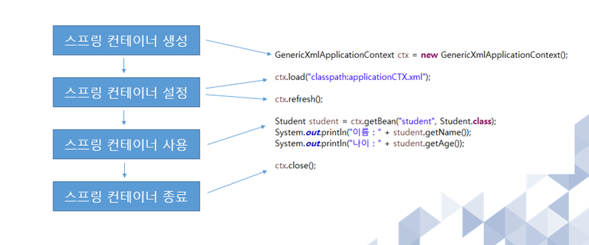

# SPRING CONTAINER

* 주입을 이용해 객체를 관리하는 컨테이너
* 객체 관리를 주로 수행하는 그릇
* 빈의 생성, 관계, 사용, 생명 주기등을 관장
* 시스템 전반에서 언제든 사용 가능


## SPRING CONTAINER 사용이유

* 원래 : 객체를 사용하기 위해 new생성자/getter setter 기능 사용
  * 객체가 많아질수록 의존성이 높음
  * ==의존성을 낮추기 위해 SPRING CONTAINER 사용==

## 주요 용어

### POJO

* 어플리케이션의 핵심 코드를 담고 있는 클래스
* Plain Old Java Object, 오래된 방식의 자바 객체
* 특정 환경에 종속없는 단순 클래스
  * <종속이 없다>
  * 코드를 간결하게 할 수 있다
  * 객체지향 설계

### Bean

* 스프링 컨테이너가 생성하고 관리하는 어플리케이션 객체


## 스프링 컨테이너의 종류

### BeanFactory

* 빈 공장
* 빈 객체를 생성하고 관리하는 클래스
* 디자인 패턴의 일종인 팩토리 패턴 구현

````java
BeanFactory fac = new XmlBeanFactory(new FileInputStram("bean.xml"));
MyBean = myBean = (Mybean) factory.getBean("MyBean");
getBean()
````

### ApplicationContext

* Bean과 유사하지만 향상된 형태의 컨테이너
  * 국제화 지원 텍스트 메시지 관리 가능
  * 이미지 파일 로드 가능
  * 리스너로 등록된 빈에게 이벤트 발생 통보 가능

## 생명주기




