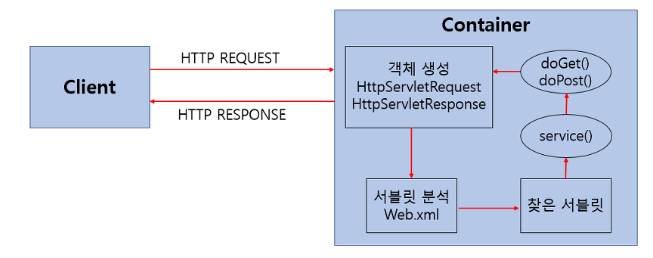
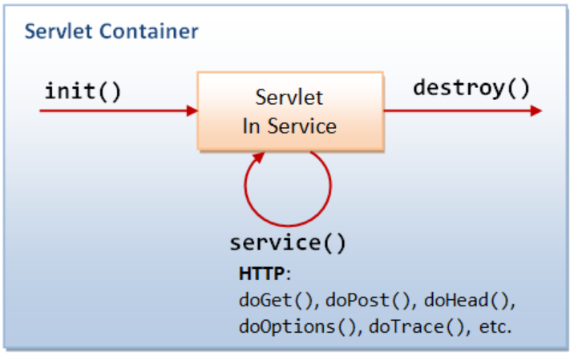
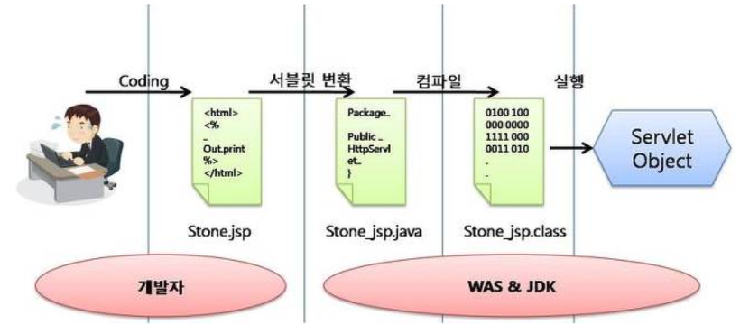

# Servlet

* 웹 프로그래밍에서 클라이언트의 요청을 처리하고 그 결과를 다시 클라이언트에게 전속하는 Servlet클래스의 구현 규칙을 지킨 자바 프로그래밍 기술
* 웹을 만들기 위해 필요한 기술
  * 클라이언트가 어떤 요청을 하면 결과를 다시 전송시켜주는 자바 프로그램

## Servlet 특징

* 웹어플리케이션 컴포넌트
  * 클라이언트의 요청에 대해 동적으로 작동
* html을 사용해 요청에 응답
* JAVA Thread를 이용해 동작
* MVC패턴에서Controller로 이용
* HTTP 프로토콜 서비스를 지원하는 `javax.servlet.http.HttpServlet ` 클래스 상속
* HTML 변경시 Servlet을 재컴파일 해야 함
* 웹서버가 동적인 페이지를 제공할 수 있도록 도와주는 어플리케이션
  * 동적인 페이지를 생성하는 어플리케이션 : CGI

## Servlet 동작 방식

1. 사용자(클라이언트)가 URL을 클릭하면 HTTP Request를 Servlet Container로 전송
2. HTTP Request를 전송받은 Servlet Container는 HttpServletRequest, HttpServletResponse 객체 생성
3. web.xml은 사용자가 요청한 URL을 분석하여 어느 서블릿에 대해 요청을 한 것인지 찾음
4. 해당 서블릿에서 service메소드를 호출한 후 클리아언트의 POST, GET여부에 따라 doGet() 또는 doPost()를 호출
5. doGet() or doPost() 메소드는 동적 페이지를 생성한 후 HttpServletResponse객체에 응답을 보냅니다.
6. 응답이 끝나면 HttpServletRequest, HttpServletResponse 두 객체를 소멸시킵니다

## Servlet Container

* 서블릿을 관리해주는 컨테이너

* 서블릿은 스스로 작동하는 것이 아님

* 서블릿 : 어떠한 역할을 수행하는 정의서

  * 서블릿 컨테이너 : 정의서를 보고 수행하는 것

* 클라이언트의 요청을 받아주고 응답할 수 있게 웹서버와 소켓을 만들어 통신

* Tomcat!!

  * 웹서버와 통신해 JSP와 Servlet이 작동하는 환경을 제공

  ### Servlet Container 역할

1. 웹서버와의 통신 지원
   * 서블릿과 웹서버가 쉽게 통신할 수 있게 함
     * 기존 : 소켓 만들기, listen, accept.. 구현해야 함
     * 현재 : API제공, 개발자가 서블릿에 구현해야 할 비지니스 로직에 초점
2. 서블릿 생명주기 관리
   * 서블릿의 탄생과 죽음 관리
   * 서블릿 클래스 로딩, 인스턴스, 초기화,적절한 서블릿 메소드 호출
     * 서블릿이 끝나면 GC를 진행
3. 멀티쓰레드 지원 및 관리
   * 서버가 다중쓰레드 생성  및 운영, 쓰레드의 안정성에 걱정할 필요 없음
     * 요청이 올 때마다 새로운 자바쓰레드 생성
     * HTP 서비스 메소드를 실행후 쓰레드는 자동으로 죽음 -> 원래는 쓰레드 관리해야함
4. 선언적인 보안 관리
   * 보안에 관련된 내용을 서블릿, 자바 클래스에 구현할 필요 없음
   * XML 배포 서술자에 보안관리
   * 보안 수정할 일이 있어도 자바코드 수정, 재컴파일 필요 없음

## Servlet 생명주기

1. 요청 들어온 후 init() 호출

   * 클라이언트의 요청이 들어오면 해당 컨테이너는 해당 서블릿이 메모리에 있는지 확인, 없을 경우 init() 메소드 호출해 적재

   * init메소드(호출)는 처음 한번만 실행됨
   * 서블릿의 쓰레드에 공통적으로 사용해야 할 것이 있다면 오버라이딩해 구현
   * 실행 중 서블릿이 변경된 경우 기존 서블릿을 파괴하고 init()을 통해 새로운 내용 다시 적재

2. doGet->doPost, request, response

   * init()이 호출된 후 클라이언트의 요청에 따라 service()메소드를 통해  요청해 doGet()이 doPost가 됨
   * HttpServletRequest,HttpServletResponse에 의해 request와 response 객체 제공
     * 서블릿 컨테이너가 클라이언트의 요청이 오면 가장 먼저 처리하는 과정

3. 종료요청, destroy()메소드 호출

   * 컨테이너가 서블릿에 종료요청을 하면 destroy()메소드 호출
   * 한번만 실행됨(=init)
   * 종료시 처리해야하는 작업은 destroy메소드를 오버라이딩

# JSP(Java Server Page)

* JAVA 가 들어있는 HTML코드

* 서블릿 : 자바 소스코드 속에 HTML코드가 들어가 있음

* JSP : HTML 소스코드 속에 자바 소스코드가 들어있는 구조

  

## JSP 특징

  * <%소스코드%>` `<%=소스코드=%>`

  * 자바 소스코드로 작성된 부분은 웹 브라우저로 보내는 것이 아닌 *웹서버*에서 실행
  * 웹프로그래머가 소스코드 수정시 자바소스코드만 수정하면 됨 -> 효율
  * 컴파일 필요 없이 JSP 페이지를 작성하여 웹 서버의 디렉토리에 추가하면 사용가능
  * 복잡한 서블릿 규칙 대안으로 JSP가 나옴
    * WAS(Web Application Server)에 의해 서블릿 클래스로 변환돼 사용

## JSP 동작 구조

1. 요청받기, 서블릿컨테이너에게 요청 넘기기
2. HTTP Request와 HTTP Response 객체를 만들어 서블릿doPost()나 doGet()메소드 중 하나 호출
   * 서블릿만 이용한다면 out 객체의 pring 메소드를 사용해 HTML 문서 작성 -> 추가/수정 어려움 가독성 떨어짐
   * JSP를 사용해 비즈니스 로직과 프레젠테이션 로직 분리
     * JSP : 데이터의 입력, 수정 등의 제어
3. 컨테이너에게 Response를 전달
4. 사용자가 해당페이지를 요청하면 컴파일 되어 자바파일을 통해 class파일이 만들어지고  로직이 결합되어 클래스화 되는 것을 확인 가능
   * out객체의 println메소드를 사용해 구현하는 번거로움을 JSP가 대신 수행